# SingSurf
A mathematical curve and surface visualiser for singular surface and objects from Singularity Theory.

The program can calculate many of the objects found in Singularity theory and geometry:

* **Algebraic curves** defined by a single polynomial equation in two variables. e.g. electric motor 
`y^2(y^2-9)-x^2(x^2-10);`

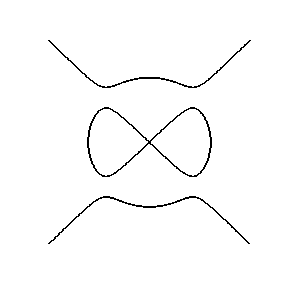
* **Algebraic surfaces** defined by a single polynomial equation in three variables. e.g. a Chubs surface
`x^4 + y^4 + z^4 - x^2 - y^2 - z^2 + 0.5;`
            
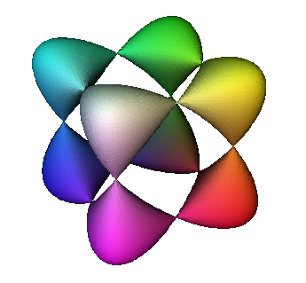
* **Paramertised curves** defined by a 3D vector expression in a single variable. e.g. a helix
`[cos(pi t), sin(pi t), t];`    
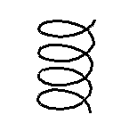
* **Parameterised surfaces** defined by a 3D vector expression in two variables. e.g. a cross-cap
`[x,x y,y^2]`          
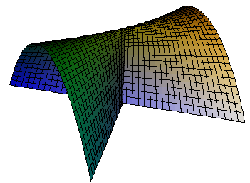

* **Intersection** of surfaces with sets defined by another equation. 
For example the intersection of a conical surface with the set defined by a plane `a x b y + cz =d`.

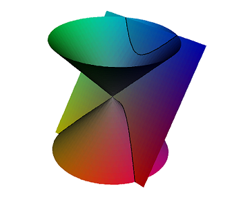

It can be used to calculate non-polynomial curves. 
For example a super ellipse `pow(abs(x/a),p)+pow(abs(y/b),p)-1` 

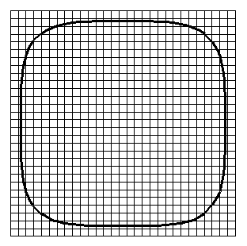

* **Clipping**, part of a surface inside a set define by an implicit equation, like the set inside a box 
`min(min(min(xh-x,x-xl),min(yh-y,y-yl)),min(zh-z,z-zl))`,
or clipped by a sphere `x^2+y^2+z^2-r^2`
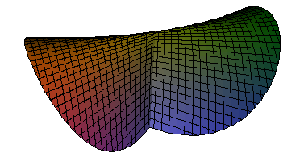

* **Mapping** from R^3 to R^3 defined by 3D vector equation in three variables. e.g. a rotation
`[cos(pi th) x - sin(pi th) y,sin(pi th) x + cos(pi th) y,z];`   	
		   
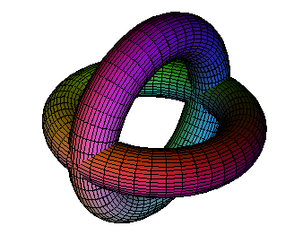
* **Vector Fields**, including unoriented vector field, and binary differential equations

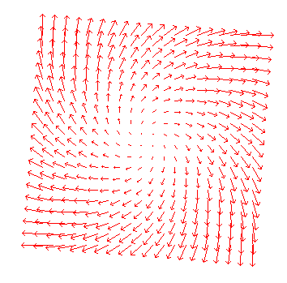

* **Integral Curves**. Uses the points in a geometry to define the starting points

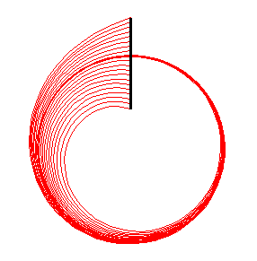

* **Colourise**: sets the colour of a surface depending on an expression. For example to colour by the z coordinate
`[(z+1), 0,(1-z)];`	setting the red, green, and blue components for each point. 
	
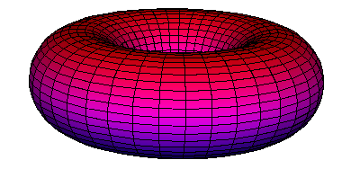
* **Extrude**: produces surfaces of revolution and similar surfaces which depend on a curve and an equation. 
Can be used to produce families of curves.

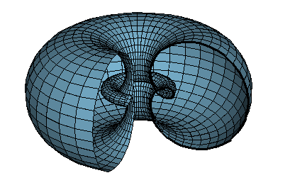
	 
Several of these models have versions where the equation of another curve or surface can be used as part of the definition

* **Generalised Mappings** where the equation depends on another surface. For example projection of a curve onto a surface.
For example Gauss Map of a surface

```
	N / sqrt(N.N);   // Unit normal
	N = Sx ^^ Sy;    // calculate normal using cross product
	Sx = diff(S,x);  // derivatives of surface S
	Sy = diff(S,y);  // Definition of S read from the input surface
```

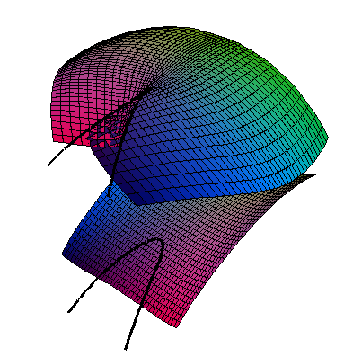
* **Generalised Intersections** where the equation depends on the definition of another curve or surface. 
e.g. The profile of a surface, or parabolic lines

			// The profile of a surface
			N . [A,B,C];
			N = diff(S,x) ^^ diff(S,y);	

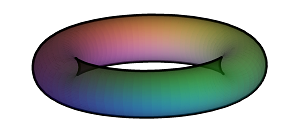

* **Generalised Clipping**: eg the part of 	surface contained inside another already defined implicit surface

* **Generalsied Colourise**: colour by Gaussian or mean curvature

* **Generalised Extrude**: eg tangent developable of a curve, or envelope of normals

```
        S + t T;            // Point on surface plus a multiple of unit tangent
        T = TT/sqrt(TT.TT); // unit length
        TT = diff(S,x);     // tangent to curve
```
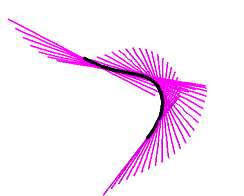

* **Generalised Vector Fields**: eg. principle directions which are caluclated using the definition of the input surface

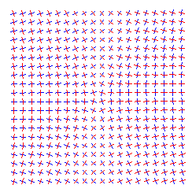

* **Generalised Integrals Curves**: e.g. principle curves of a surface caluclated using the definition of the input surface

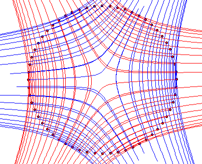

There are some more specialised modules

* Ridge Integsections: curves which depend on a surface and a vector field, for example the ridges of a surface 

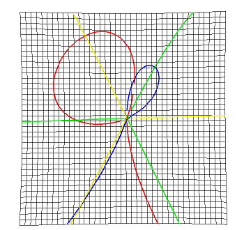

* **BiIntersection** Intersections where the equations depends on a pair of curves. For example the pre-symmetry set of a curve.

* **BiMap** Mapping where the equation depends on a pair of curves. For example the Symmetry set.

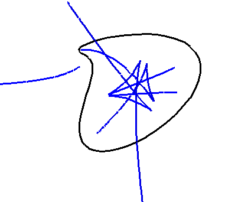

* Projective varities: algebraic surfaces defined in real projective space, 
with options for sterographic projections and rotations in 4D


## Requirements

The program requires

* Java version 8 or upwards.
* JavaView mathematical visualization software from [javaview.de](http://www.javaview.de/) Alas not open-source
* JEP 2.4.1 Java Expression Parser, a mathematical parser evaluator from my fork [jep-java-gpl](https://github.com/RichardMorris/jep-java-gpl) which may contain some customisation of the package to fit the needs of the SingSurf program.

It is a good idea to register your version of JavaView. Regestration provides a licence file `jv-lic.lic` which should be copied to the `rsrc` directory, this prevents a notification message appearing.    

## Installation and running

The souce code can be downloaded from (SingSurfGPL on github)[https://github.com/RichardMorris/SingSurfGPL].

A zip file with an executable jar file and all necessary files is availiable from [singsurf.org](http://singsurf.org/singsurf/SingSurfPro.html). Once unpacked this can be run using a single line java command.

For the git source code, there are three different main classes
* `org.singsurf.singsurf.SingSurf3D` the 3D version with all sub-types
* `org.singsurf.singsurf.SingSurf2D` the 2D version, with setting for examining curves in the plane
* `org.singsurf.singsurf.ASurfSimp` a simplified version just with the algebraic surface component


					               
