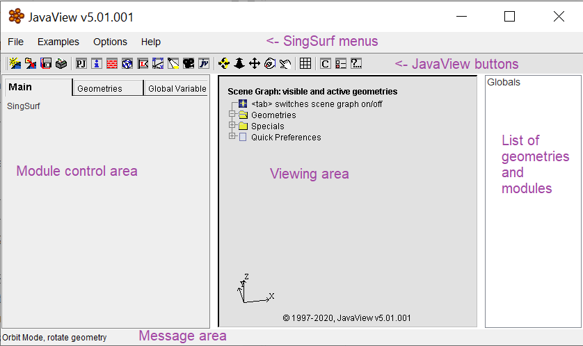
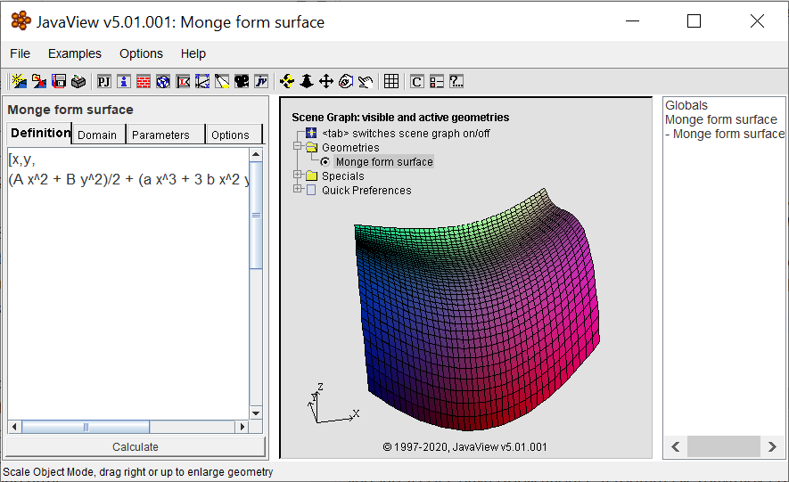

# SingSurf

## Running the program

Once started the user interface looks like:

The program runs inside the JavaView program so the titlebar shows the JavaView version. 
The icon bar are also the standard JavaView option. 

The left hand side of the user interface contains the controls for the individual curve or surface. 
Here you will be able to adjust values of parameters or the size of the domain used to calculate the surface.

The middle region is where geometry will be displayed. This window uses JavaView to handle 
rotation and selection of objects to display.

The right hand side is a list of all  the different modules and surfaces created. 
This can be used to switch between different modules.

